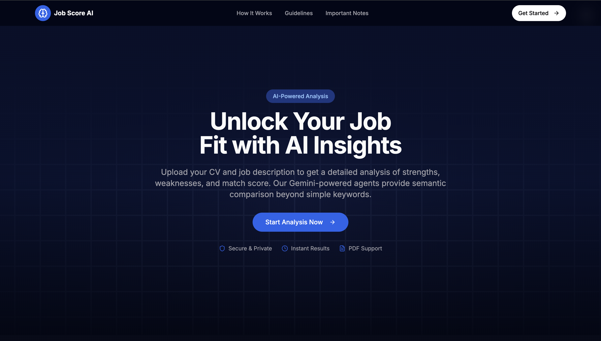

# JobScoreAI - CV Analysis Platform
## This project is part of the Woolf University assessment.

A Next.js application that analyzes CVs against job descriptions using AI to provide detailed compatibility scoring and recommendations.

## Demo

- Live app: [https://job-score-ai-ebon.vercel.app](https://job-score-ai-ebon.vercel.app/)
- Screenshots:
  - Landing: 
  - Guidelines: 
  - Upload: 
  - Results: 
  - Download Report: 

## Quick Start

### Prerequisites
- Node.js 18+ 
- npm or pnpm

### Setup

1. **Clone and install dependencies:**
```bash
git clone <repository-url>
cd JobScoreAI
npm install
```

2. **Environment Configuration:**
```bash
# IMPORTANT: You MUST set up your Gemini auth token
# Edit .env.local (already created) and replace the placeholder:
nano .env.local
# or
code .env.local

# Replace with actual Woolf-provided token:
WOOLFAUTH=gemini_auth_token_from_woolf_email
```

3. **Start development server:**
```bash
npm run dev
```

4. **Open application:**
Visit [http://localhost:3000](http://localhost:3000)

## ✅ Usage

1. Open the Upload page from the landing screen or visit `/upload`.
2. Select your CV and Job Description PDF files (each ≤ 5MB).
3. Click "Analyze Now" to process and view results.
4. Results can be downloaded as a PDF report.

## 🧪 Testing

Run the test suite:
```bash
npm run test
```

## 📁 Project Structure

```
JobScoreAI/
├── app/                    # Next.js App Router
│   ├── api/analyze/       # API endpoint
│   ├── upload/            # File upload page
│   └── results/           # Analysis results page
├── server/                # Backend architecture
│   ├── controllers/       # Business logic orchestration
│   ├── processors/        # Data transformation
│   ├── accessors/         # External API calls
│   ├── validators/        # Input validation schemas
│   ├── agents/           # AI prompt management
│   └── utils/            # Helper functions
├── components/           # React UI components
├── types/               # TypeScript definitions
└── tests/              # Test files
```

## 🔧 Architecture

### Backend Layers
- **Controllers**: Orchestrate business logic and use cases
- **Processors**: Pure data transformation and validation
- **Accessors**: External API calls and data access
- **Validators**: Zod schemas for input validation
- **Agents**: AI prompt management and configuration

### API Endpoints
- `POST /api/analyze` - Accepts job description and CV PDFs, returns analysis

### Implementation Note (no tRPC)
- The assessment mentions tRPC; this implementation uses Next.js App Router API routes instead (under `app/api/analyze/route.ts`) and a layered backend in the `server` folder (`controllers`, `processors`, `accessors`, `validators`, `agents`, `utils`). This keeps concerns separated and aligns with production-ready patterns.

### File Handling
- PDFs are parsed in-memory in the API route; no files are written to disk.

## 🌟 Features

- **PDF Upload**: Drag & drop interface for job descriptions and CVs
- **AI Analysis**: Powered by Gemini API (provided by Woolf)
- **Detailed Scoring**: Technical skills, experience, education, soft skills
- **Actionable Insights**: Strengths, weaknesses, and improvement suggestions


## 🔐 Environment Variables

| Variable | Description | Required |
|----------|-------------|----------|
| `WOOLFAUTH` | Gemini API authentication token | Yes |
| `NODE_ENV` | Environment (development/production) | No |

## 📋 API Usage

### Analyze CV
```bash
curl -X POST http://localhost:3000/api/analyze \
  -F "job=@job-description.pdf" \
  -F "cv=@resume.pdf"
```

### Response Format
```json
{
  "overallScore": 78,
  "analysis": {
    "strengths": ["Strong programming skills..."],
    "weaknesses": ["Missing cloud experience..."],
    "skillsBreakdown": {
      "technical": 85,
      "experience": 80,
      "education": 90,
      "soft_skills": 65
    },
    "suggestions": ["Consider AWS certification..."],
    "detailedAnalysis": {
      "technicalSkills": {
        "matched": ["JavaScript", "React"],
        "missing": ["AWS", "Docker"]
      },
      "experienceNotes": "Strong development experience...",
      "educationNotes": "Computer Science degree provides..."
    }
  }
}
```

## Development

### Assumptions & Limits
- PDFs only; size ≤ 5MB each.
- Text-based PDFs work best (scanned images may reduce quality of extraction).
- API rate limits: 20 requests/minute, 300 requests/hour (enforced via p-limit in `server/accessors/gemini.accessor.ts`).
- Token/output constraints: model response targeted at ≤ 1200 output tokens; very large inputs may be truncated by upstream providers.

### Rate Limiting
- 20 requests per minute
- 300 requests per hour
- Automatic retry and backoff handling

## Troubleshooting
### Common Issues
1. **ENOENT PDF Error**: This has been fixed with a patch to `pdf-parse`. If you encounter it after fresh install, run `npm run postinstall`
2. **Auth Errors**: Verify `WOOLFAUTH` is set in `.env.local` with your actual Woolf token (not the placeholder)
3. **Rate Limiting**: Respect API limits
4. **"Invalid PDF structure"**: Ensure you're uploading actual PDF files, not other document types

### Debug Mode
Set `NODE_ENV=development` for detailed error logs and debug information.

### Fresh Install
If you encounter issues after `npm install`, run:
```bash
npm run postinstall  # This applies the pdf-parse patch automatically
```

## Agents / AI (placeholder)

This section will be expanded with details on multi-agent orchestration, prompt strategies, and schema validation improvements in a future update.